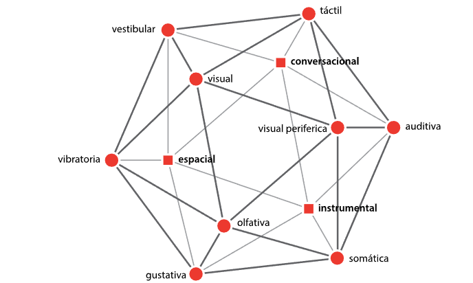

# Estudio perceptual de la multisensorialidad

El enfoque contemporáneo en diseño ha evolucionado hacia la comprensión y aplicación de la percepción multisensorial como una herramienta fundamental para crear experiencias significativas que sean aplicables a proyectos de diseño. Este proyecto se propone explorar la intersección de múltiples canales sensoriales, reconociendo que la percepción no se limita únicamente a la visión, sino que también involucra canales sensoriales.

*Esquema de Interacción Multisensorial. Fuente: Manuel Guerrero, 2015.*

---

## Productos

``Guerrero-Salinas, M. (2021). Modelo de interacciones multisensoriales en el diseño. En Irigoyen, L. Villalba, E. (Ed.) Prospectiva del diseño. Redefiniendo el futuro disciplinar, Volumen 1. (pp. 173-184). Hermosillo, México: Universidad de Sonora.``

``Guerrero-Salinas, M. (2020). La multisensorialidad en el diseño. Revista Internacional de Principios y Prácticas Del Diseño, 1(2), 11–27. https://doi.org/10.18848/2641-4406/CGP/v02i01/1-9``

``Guerrero-Salinas, M. y Mancilla González, E. (2017). Interacciones multisensoriales en el diseño. DAYA. Diseño, Arte Y Arquitectura, (2), 7 – 25. Consultado de DOI: https://doi.org/10.33324/daya.v1i2.27``
